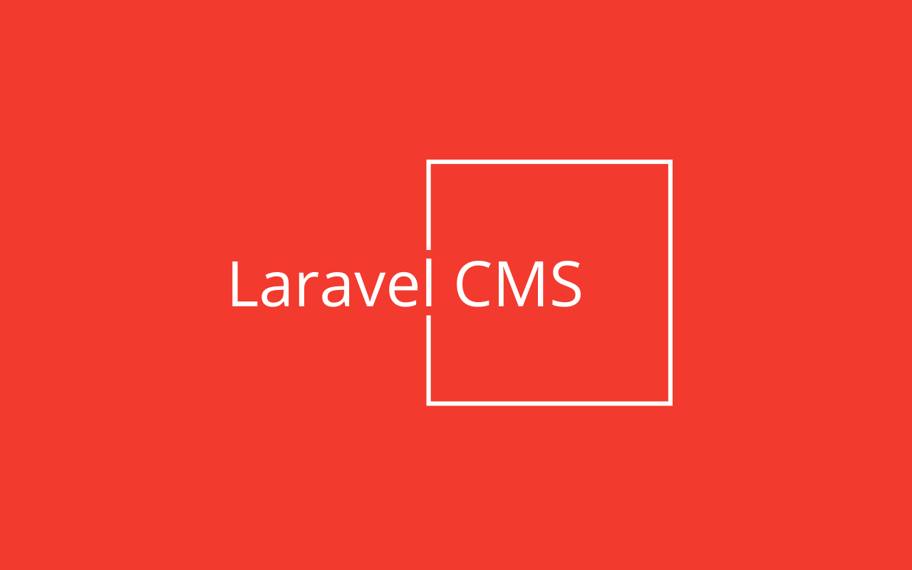

# Laravel CMS - Powerful as Contentful, simple as Wordpress!

The easy, flexible and scalable API-first Laravel CMS package:

* Manage structured content like in Contentful
* Define new content elements in seconds
* Assign shared content to multiple pages
* Save, publish and revert drafts
* Extremly fast JSON frontend API
* Versatile GraphQL admin API
* Multi-language support
* Multi-domain routing
* Multi-tenancy capable
* Supports soft-deletes
* Fully Open Source
* Scales from single page with SQLite to millions of pages with DB clusters

It can be installed into any existing Laravel application.

## Table of contents

* [Installation](#installation)
* [Authorization](#authorization)
* [Configuration](#configuration)
* [Clean up](#clean-up)
* [Multi-domain](#multi-domain)
* [Multi-tenancy](#multi-tenancy)
* [Custom authorization](#custom-authorization)

## Installation

You need a working Laravel installation. If you don't have one, you can create it using:

```bash
composer create-project laravel/laravel pagible
```

The application will be available in the `./pagible` sub-directory.
Then, run this command within your Laravel application directory:

```bash
composer req aimeos/pagible
php artisan cms:install
php artisan migrate
```

Now, adapt the `.env` file of your application and change the `APP_URL` setting to your domain. If you are using `php artisan serve` for testing, add the port of the internal web server (`APP_URL=http://localhost:8000`). Otherwise, the uploading files will fail because they wouldn't be loaded!

Add a line in the "post-update-cmd" section of your `composer.json` file to update the admin backend files after each update:

```json
"post-update-cmd": [
    "@php artisan vendor:publish --force --tag=admin",
    "@php artisan vendor:publish --tag=public",
    "@php artisan migrate",
    ...
],
```

### Authorization

To allow existing users to edit CMS content or to create a new users if they don't exist yet, you can use the `cms:user` command (replace the e-mail address by the users one):

```bash
php artisan cms:user editor@example.com
```

To disallow users to edit CMS content, use:

```bash
php artisan cms:user --disable editor@example.com
```

The CMS admin backend is available at (replace "mydomain.tld" with your own one):

```
http://mydomain.tld/cmsadmin
```

### Configuration

#### Captcha protection

To protect forms like the contact form against misuse and spam, you can add the
[HCaptcha service](https://www.hcaptcha.com/). Sign up at their web site and
[create an account](https://dashboard.hcaptcha.com/signup).

In the HCaptcha dashboard, go to the [Sites](https://dashboard.hcaptcha.com/sites)
page and add an entry for your web site. When you click on the newly generated entry,
the **sitekey** is shown on top. Add this to your `.env` file as:

```
HCAPTCHA_SITEKEY="..."
```

In the [account settings](https://dashboard.hcaptcha.com/settings/secrets), you will
find the **secret** that is required too in your `.env` file as:

```
HCAPTCHA_SECRET="..."
```

#### DeepL translation

For enabling translation of content to the supported languages by DeepL,
[create an account](https://www.deepl.com/en/signup) at the DeepL web site first.

In the DeepL dashboard, go to [API Keys & Limits](https://www.deepl.com/en/your-account/keys)
and create a new API key. Copy the key and add it to your `.env` file as:

```
DEEPL_API_KEY="..."
```

If you signed up for a PRO account, also set the DeepL API URL to:

```
DEEPL_API_URL="https://api.deepl.com/"
```

#### AI support

To generate texts/images from prompts, analyze image content, or execute actions based on
your prompts, you have to configure one of the AI service providers supported by the
[Prism](https://github.com/prism-php/prism/blob/main/config/prism.php) package.

The best-known service provider is from [OpenAI](https://openai.com/) which is pre-configured
in Pagible. The service provider with the best data protection is [Mistral](https://mistral.ai/)
from France which you should use instead if you are operating within the EU.

All service providers require to sign-up and create an account first. They will provide
an API key which you need to add to your `.env` file as shown in the
[Prism configuration](https://github.com/prism-php/prism/blob/main/config/prism.php) file, e.g.:

```
OPENAI_API_KEY="..."
MISTRAL_API_KEY="..."
DEEPSEEK_API_KEY="..."
```

**Note:** You only need to configure API keys for the AI service providers you are using, not for all!

If you want to use an AI service different to OpenAI or a specific AI model offered by the
AI service provider, you have to add this configuration:

```
CMS_AI_TEXT="openai"
CMS_AI_TEXT_MODEL="chatgpt-4o-latest"

CMS_AI_IMAGE="openai"
CMS_AI_IMAGE_MODEL="dall-e-3"
```

For texts and images, you can use different AI service providers and models.

### Publishing

For scheduled publishing, you need to add this line to the `routes/console.php` class:

```php
\Illuminate\Support\Facades\Schedule::command('cms:publish')->daily();
```

### Clean up

To clean up soft-deleted pages, elements and files regularly, add these lines to the `routes/console.php` class:

```php
\Illuminate\Support\Facades\Schedule::command('model:prune', [
    '--model' => [
        \Aimeos\Cms\Models\Page::class,
        \Aimeos\Cms\Models\Element::class,
        \Aimeos\Cms\Models\File::class
    ],
])->daily();
```

You can configure the timeframe after soft-deleted items will be removed permantently by setting the [CMS_PURGE](https://github.com/aimeos/pagible/blob/master/config/cms.php) option in your `.env` file. It's value must be the number of days after the items will be removed permanently or FALSE if the soft-deleted items shouldn't be removed at all.

### Multi-domain

Using multiple page trees with different domains is possible by adding `CMS_MULTIDOMAIN=true` to your `.env` file.

### Multi-tenancy

Laravel CMS supports single database multi-tenancy using existing Laravel tenancy packages or code implemented by your own.

The [Tenancy for Laravel](https://tenancyforlaravel.com/) package is most often used. How to set up the package is described in the [tenancy quickstart](https://tenancyforlaravel.com/docs/v3/quickstart) and take a look into the [single database tenancy](https://tenancyforlaravel.com/docs/v3/single-database-tenancy) article too.

Afterwards, tell Laravel CMS how the ID of the current tenant can be retrieved. Add this code to the `boot()` method of your `\App\Providers\AppServiceProvider` in the `./app/Providers/AppServiceProvider.php` file:

```php
\Aimeos\Cms\Tenancy::$callback = function() {
    return tenancy()->initialized ? tenant()->getTenantKey() : '';
};
```

### Custom authorization

If you want to integrate Laravel CMS into another application, you may want to grant access based ony your own authorization scheme. You can replace the Laravel CMS permission handling by adding your own function. Add this code to the `boot()` method of your `\App\Providers\AppServiceProvider` in the `./app/Providers/AppServiceProvider.php` file:

```php
\Aimeos\Cms\Permission::$callback = function( string $action, ?\App\Models\User $user ) : bool {
    if( /* check access */ ) {
        return true;
    }

    return false;
};
```

The first parameter is the action access is requested for, e.g. "page:view" while the second parameter is the user object if authenticated. By default, permissions of CMS users are checked against the authorization bitmap from the `cmseditor` column of their user object from the Laravel `users` table. The function must return TRUE to grant access or FALSE if access is denied.

Available actions which access can be granted to are:

* page:view (show page tree)
* page:save (update existing pages)
* page:add (add new pages)
* page:drop (soft-delete pages)
* page:keep (restore soft-deleted pages)
* page:purge (delete pages permanently)
* page:publish (publish page meta data)
* page:move (move pages in the tree)
* element:view (show elements)
* element:save (update existing elements)
* element:add (add new elements)
* element:drop (soft-delete elements)
* element:keep (restore soft-deleted elements)
* element:purge (delete elements permanently)
* element:publish (publish elements)
* file:view (show uploaded files)
* file:save (update existing files)
* file:add (add new files)
* file:drop (soft-delete files)
* file:keep (restore soft-deleted files)
* file:purge (delete files permanently)
* file:publish (publish files)
