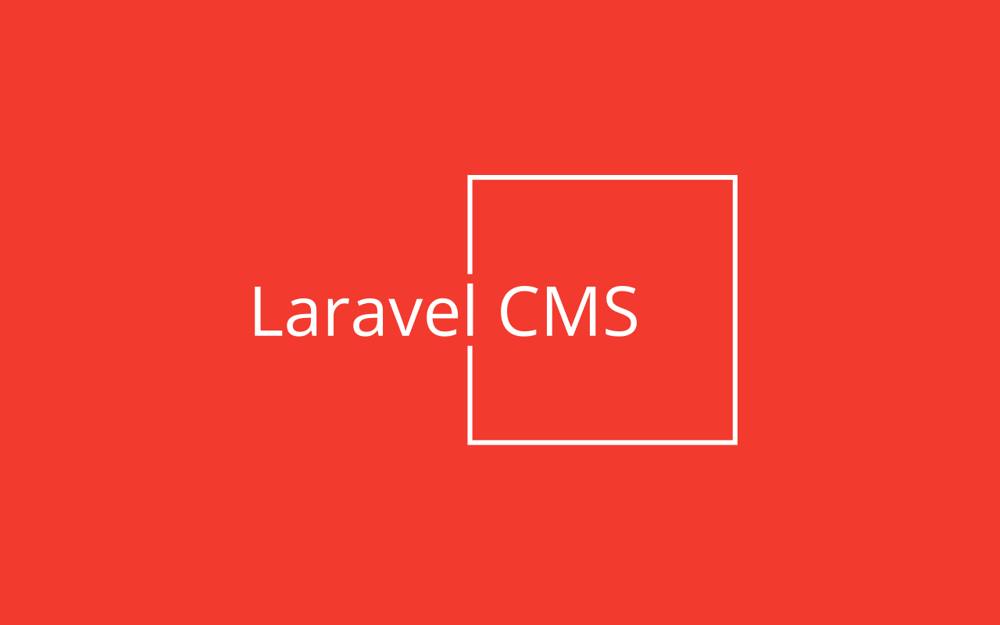

# Laravel CMS - Powerful as Contentful, simple as Wordpress!

The easy, flexible and scalable API-first Laravel CMS package:

* Manage structured content like in Contentful
* Define new content elements in seconds
* Allows nested content elements
* Save, publish and revert drafts
* Assign content to multiple pages
* Extremly fast JSON frontend API
* Versatile GraphQL admin API
* Multi-language support
* Multi-domain routing
* Multi-tenancy capable
* Supports soft-deletes
* Fully Open Source
* Scales from single page with SQLite to millions of pages with DB clusters

It can be installed into any existing Laravel application.

## Installation

Run this command within your Laravel application directory:

```bash
php artisan cms:install --seed
```

If you don't want to add any demo pages, remove the `--seed` option.

### Authorization

To allow existing users to edit CMS content or to create a new user if it doesn't exist yet, you can use the `cms:editor` command (replace the e-mail address by the users one):

```bash
php artisan cms:editor editor@example.com
```

To disallow users to edit CMS content, use:

```bash
php artisan cms:editor --disable editor@example.com
```

### Clean up

To clean up deleted pages, contents and files regularly, add these lines to the `schedule()` method in your `app/Console/Kernel.php` class:

```php
$schedule->command('model:prune', [
    '--model' => [
        \Aimeos\Cms\Models\Page::class,
        \Aimeos\Cms\Models\Version::class,
        \Aimeos\Cms\Models\Content::class,
        \Aimeos\Cms\Models\File::class],
])->daily();
```

### Multi-domain

Using multiple page trees with different domains is possible by changing the `cms.page` route in your `./routes/web.php` to:

```php
Route::group(['domain' => '{domain}'], function() {
    Route::get('{slug?}/{lang?}', [\Aimeos\Cms\Http\Controllers\PageController::class, 'index'])->name('cms.page');
});
```

The `domain` property in the pages must then match the request domain.

### Multi-tenancy

Laravel CMS supports single database multi-tenancy using existing Laravel tenancy packages or code implemented by your own.

The [Tenancy for Laravel](https://tenancyforlaravel.com/) package is most often used. How to set up the package is described in the [tenancy quickstart](https://tenancyforlaravel.com/docs/v3/quickstart) and take a look into the [single database tenancy](https://tenancyforlaravel.com/docs/v3/single-database-tenancy) article too.

Afterwards, tell Laravel CMS how the ID of the current tenant can be retrieved. Add this code to the `boot()` method of your `\App\Providers\AppServiceProvider` in the `./app/Providers/AppServiceProvider.php` file:

```php
\Aimeos\Cms\Tenancy::$callback = function() {
    return tenancy()->initialized ? tenant()->getTenantKey() : '';
};
```
