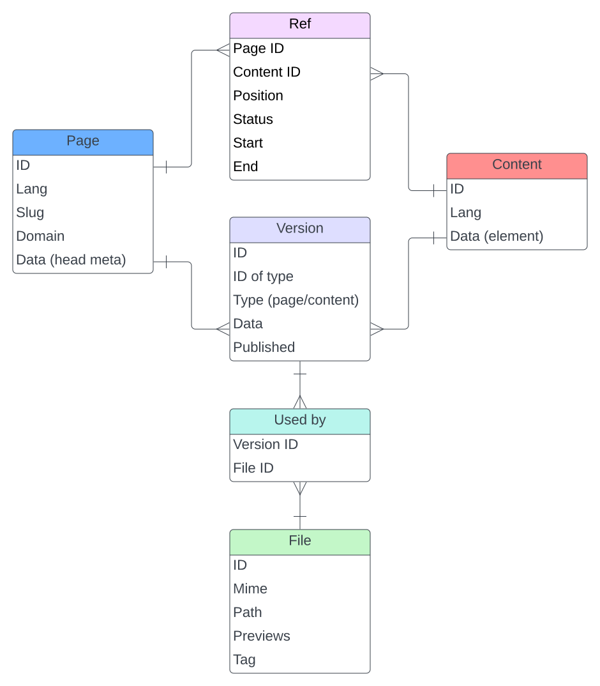

* [Entities and relations](#entities-and-relations)
* [Pages](#page-properties)
* [Contents](#content-properties)
* [References](#reference-properties)
* [Versions](#version-properties)
* [Files](#file-properties)

## Entities and relations

There are four entities use:

* Pages
* Content (elements)
* Page/Content data versions
* Files

The relations are:

* Pages can have several content elements
* Content elements can belong to several pages
* Several page data versions can exist
* Several content element versions can exist
* Page or content data contains the published version
* Files are used by page/content versions (and thus used in pages or content elements)

Here's an ER-diagram of the entities and relations:

## Page properties

id (string, read-only)
: Unique page ID

parent_id (string, read-only)
: ID of the parent page or NULL if it's a root page

lang (string)
: ISO language code, e.g. 'en', 'en_GB' or empty for default language

slug (string)
: URL segment of the page, unique in combination with the language

domain (string)
: Domain name the root page (!) is responsible for

name (string)
: Short page name for menues

title (string)
: Descriptive page title

to (string)
: If not empty, the path or URL the browser is redirected to

tag (string)
: Tag name to identify a page, e.g. for the starting point of a navigation structure

data (JSON encoded object)
: Arbitrary page header elements

config (JSON encoded object)
: Arbitrary configuration settings

status (integer)
: Visibility status of the page, 0=inactive, 1=visible, 2=hidden in navigation

cache (integer)
: Cache lifetime in minutes

start (string or NULL)
: Date/time when the page will be shown or NULL for no restriction

end (string or NULL)
: Date/time when the page will be hidden or NULL for no restriction

editor (string, read-only)
: Name of the last user who added, updated or deleted the page

created_at (string, read-only)
: Date/time value when the page was created

updated_at (string, read-only)
: Date/time value when the page was last modified

deleted_at (string or NULL, read-only)
: Date/time value when the page was deleted or NULL if it's available

has (boolean, read-only)
: If node has children

parent (object or NULL, read-only)
: Relation to the parent page or NULL if it's a root page

children (list of page objects, read-only)
: Relation to the children of the current page

ancestors (list of page objects, read-only)
: Relation to the ancestors of the current page up to the root page

contents (list of [content objects](#content-properties), read-only)
: List of content elements assigned to the page

versions (list of [version objects](#version-properties), read-only)
: List of versions for the page meta data

latest ([version object](#version-properties), read-only)
: Latest version of the page meta data

published ([version object](#version-properties), read-only)
: Published version of the page meta data

## Content properties

id (string, read-only)
: Unique content element ID

lang (string)
: ISO language code, e.g. 'en', 'en_GB' or empty for default language

data (JSON encoded object)
: Arbitrary content element

editor (string, read-only)
: Name of the last user who added, updated or deleted the content element

created_at (string, read-only)
: Date/time value when the content element was created

updated_at (string, read-only)
: Date/time value when the content element was last modified

deleted_at (string or null, read-only)
: Date/time value when the content element was deleted or NULL if it's available

pages (list of page objects, read-only)
: Relation of all pages the content element belongs to

refs ([reference object](#reference-properties))
: Meta data of page<->content relation, i.e. position, status, etc.

versions (list of [version objects](#version-properties), read-only)
: List of versioned data for the content element

latest ([version object](#version-properties), read-only)
: Latest version of the content data

published ([version object](#version-properties), read-only)
: Published version of the content data

## Reference properties

id (string, read-only)
: Unique ID of the page<->content reference

page_id (string, read-only)
: Unique ID of the referenced page

content_id (string, read-only)
: Unique ID of the referenced content element

published (boolean)
: TRUE if reference is published, FALSE if not

position (integer)
: Position the content element withing the page

status (integer)
: Visibility status of the content element within the page, 0=inactive, 1=visible

start (string or null)
: Date/time when the content element will be shown

end (string or null)
: Date/time when the content element will be hidden

editor (string, read-only)
: Name of the last user who added or updated the page<->content reference

created_at (string, read-only)
: Date/time value when the page<->content was created

updated_at (string, read-only)
: Date/time value when the page<->content was last modified

## Version properties

id (string, read-only)
: Unique version ID

data (JSON encoded object, read-only)
: Arbitrary versioned data

published (boolean, read-only)
: If versioned content is currently published or not

editor (string, read-only)
: Name of the last user who added, updated or deleted the versioned data

created_at (string, read-only)
: Date/time value when the versioned data was created

## File properties

id (string, read-only)
: Unique ID of the stored file

mime (string, read-only)
: Mime type of the stored file

tag (string)
: Tag to categorize the file

name (string)
: Descriptive name of the stored file

path (string, read-only)
: Relative path to the stored file

previews (JSON encoded object, read-only)
: Preview images of the stored file with image widths as keys

editor (string, read-only)
: Name of the last user who added, updated or deleted the file

created_at (string, read-only)
: Date/time value when the file was created

updated_at (string, read-only)
: Date/time value when the file was last modified

deleted_at (string or null, read-only)
: Date/time value when the file was deleted or NULL if it's available

versions (list of [version object](#version-properties), read-only)
: List of versions using the file
